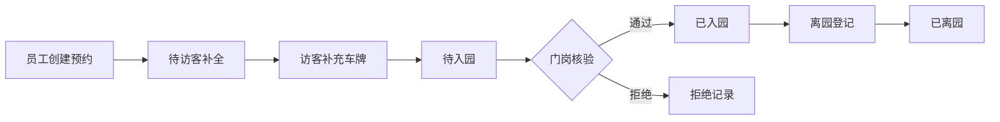
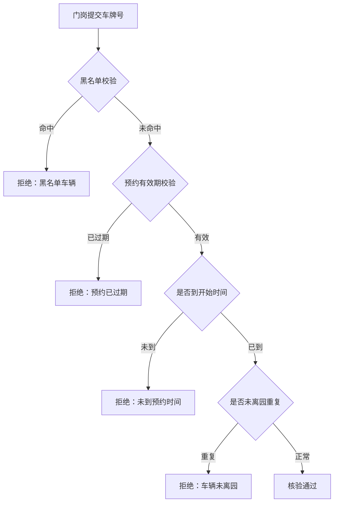

## 1. 产品概述

园区访客车辆通行管理系统，实现访客车辆从预约申请到入离园核验的全流程数字化管理。系统分为员工端、访客端和门岗端三个角色，覆盖预约申请、信息补充、入离园核验、黑名单管控等核心功能。

- 解决园区访客车辆人工登记效率低、核验不精准、追溯困难等问题
- 目标用户：园区员工、访客人员、门岗安保人员

## 2. 核心功能

### 2.1 用户角色

| 角色 | 登录方式 | 核心权限 |
|------|----------|----------|
| 员工 | 角色选择 | 创建访客预约、查看预约记录、取消预约 |
| 访客 | 预约链接/角色选择 | 补充车牌与同行人数、修改车牌、查看预约状态 |
| 门岗 | 角色选择 | 入园核验、离园登记、查看通行记录、拒绝放行记录 |

### 2.2 功能模块

1. **员工预约端**：预约创建、预约列表、预约详情、取消预约
2. **访客补充端**：预约信息补全、车牌修改、同行人数调整
3. **门岗核验端**：入园核验、离园登记、通行记录查询、拒绝原因查看
4. **系统管理**：黑名单管理、预约状态流转、审计日志

### 2.3 页面详情

| 页面名称 | 模块名称 | 功能描述 |
|----------|----------|----------|
| 角色选择页 | 角色切换 | 员工/访客/门岗三种身份入口选择 |
| 员工端首页 | 预约列表 | 展示当前员工发起的所有预约，按状态分类 |
| 员工端-新建预约 | 预约表单 | 填写来访事由、受访部门、访客姓名、联系方式、有效时段 |
| 员工端-预约详情 | 详情查看 | 查看预约完整信息、状态变更记录、操作按钮 |
| 访客端首页 | 待补全列表 | 展示需要补充信息的预约列表 |
| 访客端-补全信息 | 信息表单 | 补充车牌号、同行人数，支持修改车牌 |
| 门岗端首页 | 核验入口 | 车牌输入/扫码核验入口、今日通行统计 |
| 门岗端-入园核验 | 核验结果 | 展示预约信息、核验结果（通过/拒绝）、拒绝原因 |
| 门岗端-通行记录 | 记录列表 | 今日入离园记录查询、筛选、详情查看 |

## 3. 核心流程

### 3.1 预约与通行主流程

员工创建预约 → 访客补充车辆信息 → 门岗入园核验（黑名单/有效期/重复入园校验）→ 车辆入园 → 门岗离园登记 → 预约完成

### 3.2 拒绝放行场景

## 4. 用户界面设计

### 4.1 设计风格

- **主色调**：深蓝色系（#1e3a5f），体现专业、稳重的园区管理调性
- **辅助色**：绿色（#10b981）表示通过/正常，红色（#ef4444）表示拒绝/异常，橙色（#f59e0b）表示待处理
- **按钮风格**：圆角矩形（8px），带微妙阴影，hover 时有轻微上浮效果
- **字体**：系统无衬线字体，标题加粗，正文常规
- **布局风格**：卡片式布局，左侧导航 + 右侧内容区，信息层次清晰
- **图标风格**：线性图标，简洁明了

### 4.2 页面设计概览

| 页面名称 | 模块名称 | UI 元素 |
|----------|----------|---------|
| 角色选择页 | 角色卡片 | 三列卡片布局，大图标 + 角色名 + 简短描述，hover 高亮 |
| 员工端首页 | 预约列表 | 顶部统计卡片 + Tab 切换（全部/待补全/待入园/已完成）+ 列表卡片 |
| 员工端-新建预约 | 预约表单 | 左侧步骤条 + 右侧表单，表单项分组，底部操作按钮 |
| 访客端-补全信息 | 信息表单 | 预约信息展示区（只读）+ 车辆信息编辑区 + 提交按钮 |
| 门岗端首页 | 核验入口 | 大字号车牌输入框 + 核验按钮 + 今日统计数字卡片 |
| 门岗端-核验结果 | 结果展示 | 大图标结果提示 + 预约详情卡片 + 操作按钮（确认入园/查看原因） |
| 门岗端-通行记录 | 记录列表 | 搜索筛选栏 + 表格列表 + 详情弹窗 |

### 4.3 响应式设计

- 桌面端优先设计，适配 1280px 及以上宽度
- 平板端：导航收起为侧边抽屉，内容区自适应
- 移动端：单列布局，卡片堆叠，触摸友好的按钮尺寸

### 4.4 交互动效

- 页面切换：淡入淡出过渡
- 按钮点击：轻微缩放反馈
- 状态变更：颜色渐变 + 图标动画
- 核验结果：成功/失败图标弹跳出现
- 列表加载：骨架屏占位
