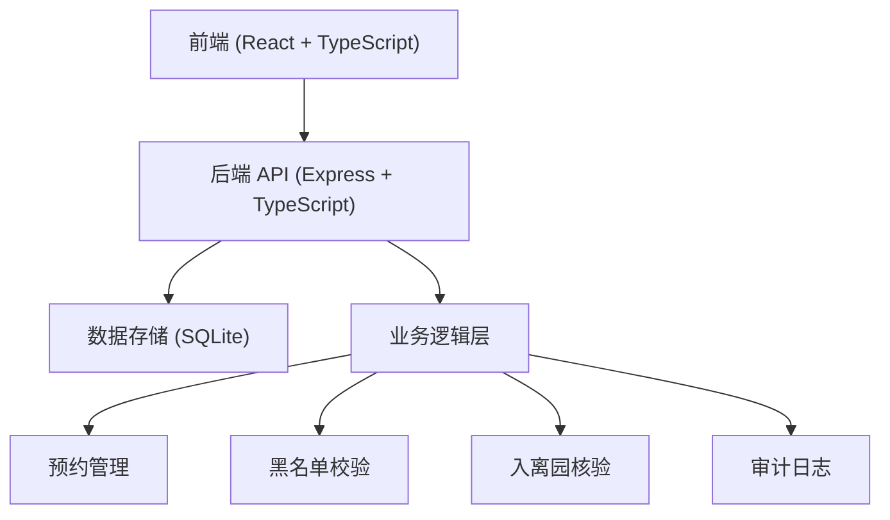
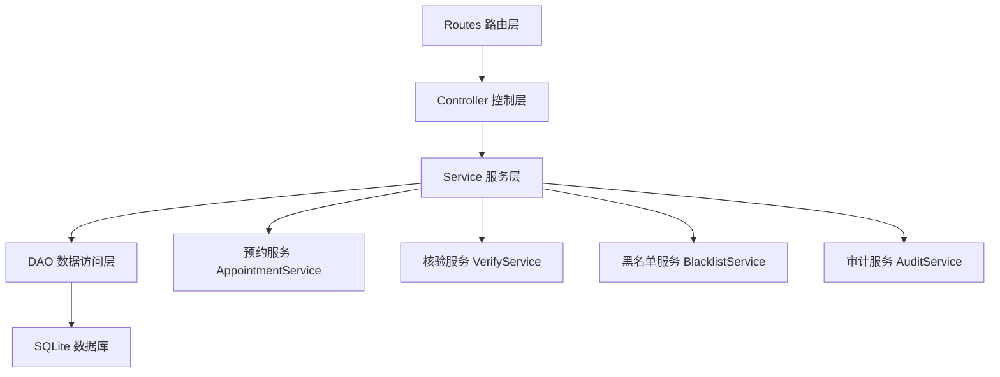
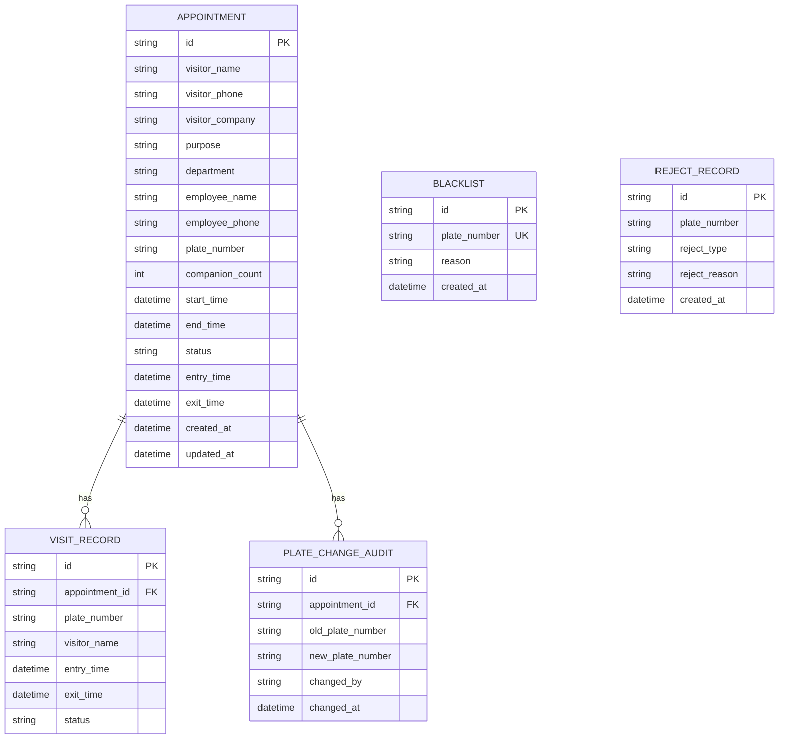

## 1. 架构设计



## 2. 技术描述

- **前端**: React@18 + TypeScript + TailwindCSS@3 + Vite + Zustand + React Router
- **初始化工具**: vite-init
- **后端**: Express@4 + TypeScript
- **数据库**: SQLite（使用 better-sqlite3）
- **容器化**: Docker + docker-compose

## 3. 路由定义

### 前端路由

| 路由 | 页面 | 说明 |
|------|------|------|
| `/` | 角色选择页 | 员工/访客/门岗角色入口 |
| `/employee` | 员工端首页 | 预约列表 |
| `/employee/new` | 新建预约 | 员工创建预约表单 |
| `/employee/:id` | 预约详情 | 查看预约详细信息 |
| `/visitor` | 访客端首页 | 待补全预约列表 |
| `/visitor/:id` | 补全信息 | 访客补充车牌与同行人数 |
| `/guard` | 门岗端首页 | 核验入口与统计 |
| `/guard/verify` | 核验结果 | 入园核验结果展示 |
| `/guard/records` | 通行记录 | 入离园记录列表 |

### 后端 API 路由

| 方法 | 路径 | 说明 |
|------|------|------|
| GET | `/api/appointments` | 获取预约列表 |
| GET | `/api/appointments/:id` | 获取预约详情 |
| POST | `/api/appointments` | 创建预约 |
| PUT | `/api/appointments/:id` | 更新预约（访客补充信息） |
| PUT | `/api/appointments/:id/cancel` | 取消预约 |
| POST | `/api/verify/entry` | 入园核验 |
| POST | `/api/verify/exit` | 离园登记 |
| GET | `/api/records` | 获取通行记录 |
| GET | `/api/blacklist` | 获取黑名单列表 |
| POST | `/api/blacklist` | 添加黑名单 |
| DELETE | `/api/blacklist/:id` | 移除黑名单 |
| GET | `/api/audit/plate-changes` | 获取车牌变更审计记录 |

## 4. API 类型定义

```typescript
// 预约状态
type AppointmentStatus = 
  | 'pending_info'    // 待访客补全信息
  | 'pending_entry'   // 待入园
  | 'entered'         // 已入园
  | 'exited'          // 已离园
  | 'cancelled'       // 已取消
  | 'expired';        // 已过期

// 预约信息
interface Appointment {
  id: string;
  visitorName: string;
  visitorPhone: string;
  visitorCompany?: string;
  purpose: string;
  department: string;
  employeeName: string;
  employeePhone: string;
  plateNumber?: string;
  companionCount: number;
  startTime: string;
  endTime: string;
  status: AppointmentStatus;
  entryTime?: string;
  exitTime?: string;
  createdAt: string;
  updatedAt: string;
}

// 创建预约请求
interface CreateAppointmentRequest {
  visitorName: string;
  visitorPhone: string;
  visitorCompany?: string;
  purpose: string;
  department: string;
  employeeName: string;
  employeePhone: string;
  startTime: string;
  endTime: string;
}

// 访客补充信息请求
interface UpdateVisitorInfoRequest {
  plateNumber: string;
  companionCount: number;
}

// 核验结果
interface VerifyResult {
  success: boolean;
  appointment?: Appointment;
  rejectReason?: string;
  rejectType?: 'blacklist' | 'expired' | 'not_started' | 'duplicate_entry' | 'not_found';
}

// 通行记录
interface VisitRecord {
  id: string;
  appointmentId: string;
  plateNumber: string;
  visitorName: string;
  entryTime?: string;
  exitTime?: string;
  status: 'entered' | 'exited';
}

// 黑名单
interface BlacklistItem {
  id: string;
  plateNumber: string;
  reason: string;
  createdAt: string;
}

// 车牌变更审计
interface PlateChangeAudit {
  id: string;
  appointmentId: string;
  oldPlateNumber?: string;
  newPlateNumber: string;
  changedBy: 'visitor' | 'employee';
  changedAt: string;
}
```

## 5. 服务端架构图



## 6. 数据模型

### 6.1 ER 图



### 6.2 DDL 语句

```sql
-- 黑名单表
CREATE TABLE blacklist (
  id TEXT PRIMARY KEY,
  plate_number TEXT UNIQUE NOT NULL,
  reason TEXT NOT NULL,
  created_at DATETIME DEFAULT CURRENT_TIMESTAMP
);

-- 预约表
CREATE TABLE appointments (
  id TEXT PRIMARY KEY,
  visitor_name TEXT NOT NULL,
  visitor_phone TEXT NOT NULL,
  visitor_company TEXT,
  purpose TEXT NOT NULL,
  department TEXT NOT NULL,
  employee_name TEXT NOT NULL,
  employee_phone TEXT NOT NULL,
  plate_number TEXT,
  companion_count INTEGER DEFAULT 0,
  start_time DATETIME NOT NULL,
  end_time DATETIME NOT NULL,
  status TEXT NOT NULL DEFAULT 'pending_info',
  entry_time DATETIME,
  exit_time DATETIME,
  created_at DATETIME DEFAULT CURRENT_TIMESTAMP,
  updated_at DATETIME DEFAULT CURRENT_TIMESTAMP
);

CREATE INDEX idx_appointments_plate ON appointments(plate_number);
CREATE INDEX idx_appointments_status ON appointments(status);
CREATE INDEX idx_appointments_start_time ON appointments(start_time);

-- 通行记录表
CREATE TABLE visit_records (
  id TEXT PRIMARY KEY,
  appointment_id TEXT NOT NULL,
  plate_number TEXT NOT NULL,
  visitor_name TEXT NOT NULL,
  entry_time DATETIME,
  exit_time DATETIME,
  status TEXT NOT NULL DEFAULT 'entered',
  FOREIGN KEY (appointment_id) REFERENCES appointments(id)
);

CREATE INDEX idx_records_plate ON visit_records(plate_number);
CREATE INDEX idx_records_status ON visit_records(status);

-- 车牌变更审计表
CREATE TABLE plate_change_audits (
  id TEXT PRIMARY KEY,
  appointment_id TEXT NOT NULL,
  old_plate_number TEXT,
  new_plate_number TEXT NOT NULL,
  changed_by TEXT NOT NULL,
  changed_at DATETIME DEFAULT CURRENT_TIMESTAMP,
  FOREIGN KEY (appointment_id) REFERENCES appointments(id)
);

-- 拒绝记录表
CREATE TABLE reject_records (
  id TEXT PRIMARY KEY,
  plate_number TEXT NOT NULL,
  reject_type TEXT NOT NULL,
  reject_reason TEXT NOT NULL,
  appointment_id TEXT,
  created_at DATETIME DEFAULT CURRENT_TIMESTAMP
);

CREATE INDEX idx_rejects_plate ON reject_records(plate_number);
CREATE INDEX idx_rejects_type ON reject_records(reject_type);
```

### 6.3 初始数据

```sql
-- 初始黑名单数据
INSERT INTO blacklist (id, plate_number, reason) VALUES
  ('bl_001', '京A88888', '被列入园区黑名单车辆'),
  ('bl_002', '沪B66666', '多次违规闯岗');

-- 初始预约数据（用于演示）
INSERT INTO appointments (id, visitor_name, visitor_phone, visitor_company, purpose, department, employee_name, employee_phone, plate_number, companion_count, start_time, end_time, status, created_at) VALUES
  ('apt_001', '张三', '13800138001', '科技有限公司', '项目对接', '技术部', '李工', '13900139001', '粤B12345', 2, datetime('now', '+1 hour'), datetime('now', '+5 hour'), 'pending_entry', datetime('now', '-30 minute'));
```
